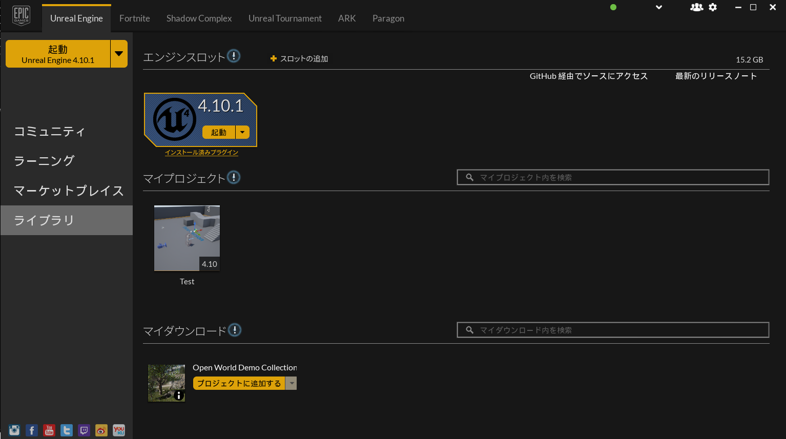
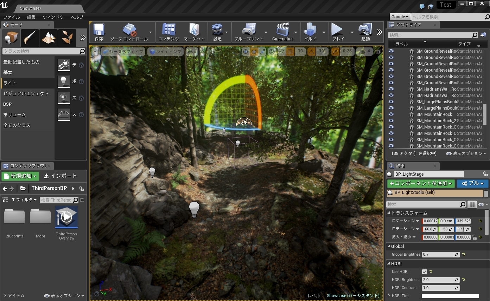
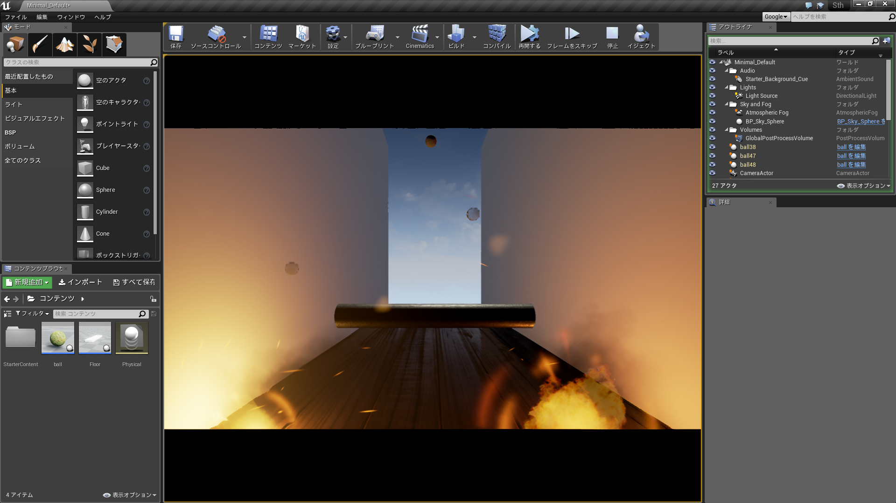

#Unreal Engineを触る

  この記事は[KMCアドベントカレンダー](http://www.adventar.org/calendars/809#list-2015-12-12)23日目の記事です
  22日目の記事はhogehogeでした
  
  こんにちは KMC-1回生のid:taiseiです。
  今日はUnreal Engine 4の話を書きます。

## Unreal Engine 4とは

  　Unreal Engine 4 とは今年(2015/3)無償化されたゲームエンジンです。
  一つ前のバージョンであるUnreal Engine 3は、リアルタイム3Dにも関わらず2Dアニメーションにしかみえないという「Guilty Gear Xrd -Sign-」というゲームに使われていたり、Unreal Engine 4は「ストリートファイターV」「ファイナルファンタジーVⅡ」「鉄拳7」「キングダムハーツⅢ」「ドラゴンクエストXⅠ」といった国産ソフトが次々と採用を発表する程の実績があります。
  
  　Unreal Engine 4はゲーム販売において、四半期の売上が3000ドルを超えた場合に限り、5%のロイヤリティが発生します。およそ30万円ですね。個人、企業で提供されるツールに差異はなく、個人の開発者にとっては非常に強力な開発ツールが降ってきたというわけです。

##特徴

  　Unreal Engine 4は強力なレンダラーで非常に綺麗なグラフィックを提供してくれます。裏を返せば、まともに動かすには相応のスペックが必要です。推奨ハードはWindows7/8、 クアッドコアIntelまたはAMDの、2.5GHz以上のプロセッサ、 8GB RAM、 DirectX11対応のグラフィックカードとあります。かなりのハイスペックが要求されていますね。
  　また、クロスプラットフォームで、Windows PC、Mac OS X、iOS、Android、VR、Linux、SteamOS、HTML5、デベロッパー登録すればPS4、XBoxOneで使用できます。非常に幅広いですね。
  　さらに、Unreal Engine 4はGitHubでソースコードを誰でも閲覧、改変できます。約300万行のc++のソースコードがあるそうです。

##導入した

  　UnrealEngine4の公式サイトへ行くとダウンロードできます。EpicGamesのアカウントを登録する必要があります。Windows用とMac用がありました。またこのプロフィールにGithubのアカウントを登録するとUnreal EngineのGitHubリポジトリに招待されます。
  
  　ここでダウンロードするのはLauncherです。というのもUnreal Engineの所有者はEpicGamesというゲーム会社で、LauncherにはEpicGamesのゲームのコンテンツも含まれています。Unreal Engine 4をインストールするには、LauncherのタブからUnreal Engine->ライブラリを選び、エンジンスロットを追加すればよいです。ちなみに、チュートリアルというタブには解説動画が、マーケットプレイスにはゲームに使えそうな素材が販売してあります。
  　Unreal Engine 4(Unreal Editorというソフト名です)をインストールし起動すると、幾つかのサンプルプロジェクトと言語が選べます。サンプルプロジェクトには2Dアクションゲームからレーシングゲームまで結構いろいろありました。言語は独自言語のブループリントとc++が選べます。後で変更も追加もできるらしいので好きなものを選べばいいでしょう。
  
##Unreal Engine 4を試す
  　マーケットプレイスに幾つか無料のマップがあるのでインポートしてみます。今回は[Open World Demo Collection](https://www.unrealengine.com/marketplace/open-world-demo-collection)をインポートしてみました。これはEpic GamesがUnreal Engine 4のデモ用に作ったものです。マーケットプレイスから入手できます。
  　入手すると、ライブラリ->マイダウンロードに追加されます。プロジェクトに追加するを選択すればプロジェクトのディレクトリ下にコンテンツがコピーされます。このOpen World Demo Collectionはなんと6.4GBもあります。
  　追加が終わったら、マップを追加したプロジェクトを開きます。テクスチャやモデルを個別に使用することもできますが、まずは配布されたマップを表示してみることにします。Unreal Editorからファイル->レベルを開く で、KiteDemo->Maps->Showcaseを開きます。メモリ不足でフリーズしたりロード失敗したりしましたが、なんとか開けました。
    
  　岩の凹凸、芝や花、葉っぱの一枚に至って細かく描画されています。パワフルですね。
  
##使い方
  　公式のドキュメントに、[Unity引越しガイド](https://docs.unrealengine.com/latest/JPN/GettingStarted/FromUnity/index.html)というものがあります。なんとここではUnityのエディタとUnreal Engine 4のエディタを直接比較しています。(公式で競合ソフトと直接比較しているって凄まじい...)
   　要するに、大体Unityを使うイメージです。オブジェクトをゲーム画面のところ(ビューポート)へ直接ドラッグすればオブジェクトが設置でき、詳細パネルからはパラメーターを設定することができます。
  　しかし、記述に使う言語は異なっていて、UnityではC#、JavaScript、Boo(Python方言らしい)が使用可能ですが、Unreal EngineにはC+&plus;とBluePrintという独自言語を使うことになっています。BluePrintではGUIでビジュアルノードをフローチャートのように結んで処理を記述することができます。
  
  変数、関数、ループ、if分岐、クラス、イベントと大体揃っているので、簡単なプログラムならこれで記述できます。BluePrintはc+&plus;に変換可能なのも有り難い機能でしょう。また、BluePrintにはクラスとレベルの二種類があります。BluePrintクラスはc+&plus;のクラスのようなものです。クラスにマテリアルやムーブメントといったコンポーネントを追加することでそれらをまとめて1オブジェクトとして扱えます。UnityのPrefabにあたる操作ともいえます。レベルはUnityのシーンにあたるもので、レベルBluePrintは1レベルに1つだけ存在して、そのレベルに存在するアクタ(オブジェクト)にアクセスできます。
  
##使った
  　とりあえずこんな感じのものができました。

  上から降ってくるボールをバーで跳ね返すゲームです。こぼすと爆発します。
  　やったことを簡単に説明します。BluePrintクラスでballとfloorを作ります。floorは画面下部の木の床に対応していて、触れたballをDestroyします。ballはDestroyされたときに爆発パーティクルを生成するよう記述しています。壁と天井(Cube)と、コンポーネントにバー(横向きのCylinder)を持つPawnを配置し、レベルBluePrintでマウスの動きをバーに加える処理と、時間経過でballを生成する処理をします。最後にカメラをいい感じの場所において細かい設定をします。ざっとこんな感じです。物理演算はUnreal Engine 4がいい感じにやってくれます。物理演算が気に入らなければ、物理マテリアルのアセットを作ってインポートすれば摩擦係数とか反発係数とかが設定できます。移動可能な平面の束縛、物理演算の有無、衝突判定の有無、プレイヤーポーンの設定、テクスチャの設定等はすべて詳細タブから設定できます。BluePrintクラスのところを除くとさほどUnityと変わらないとも言えると思います。

##使ってみて
  Unreal Engine 4は拡張性の上がったUnityという感じです。拡張性が上がった分敷居は上がっていますし、無償化して間もないUnreal Engine 4は公式以外のDocumentは比較的少ないです。インポート、エクスポートをすると、メモリが足りなくて結構落ちたりしますが、それでもグラフィックの質は目を見張るものがあります。本気で3Dゲームを作ろうと思うならば検討の余地はあるでしょう。
  
## [Unreal Engine 4 公式](https://www.unrealengine.com/what-is-unreal-engine-4)
  